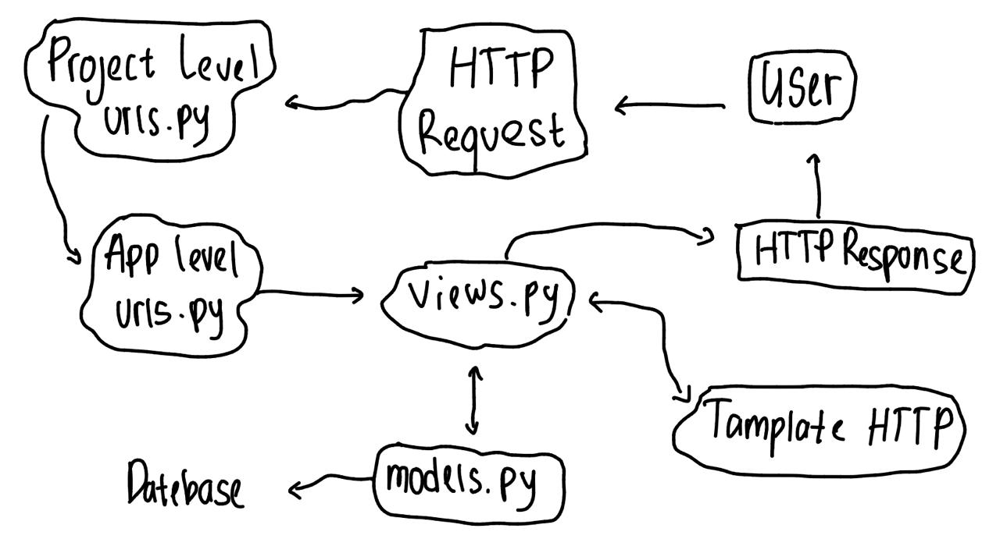
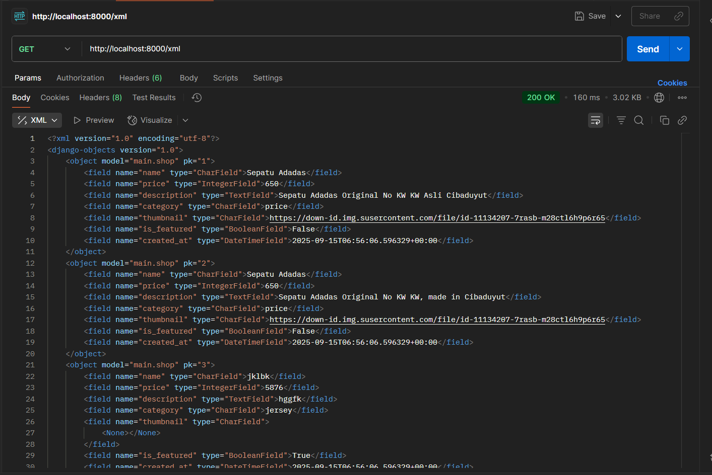
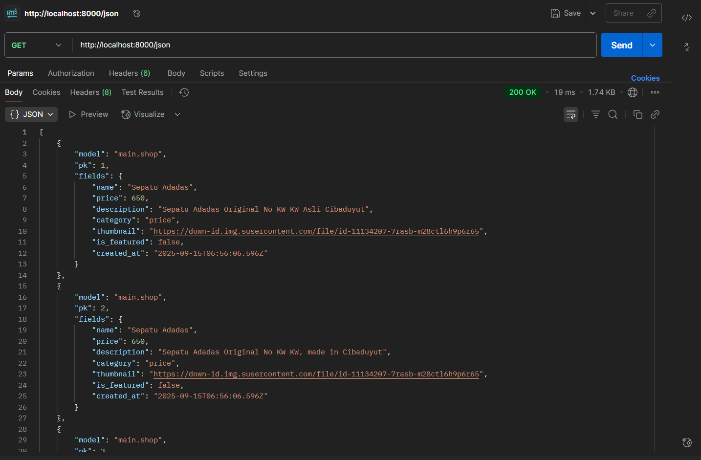
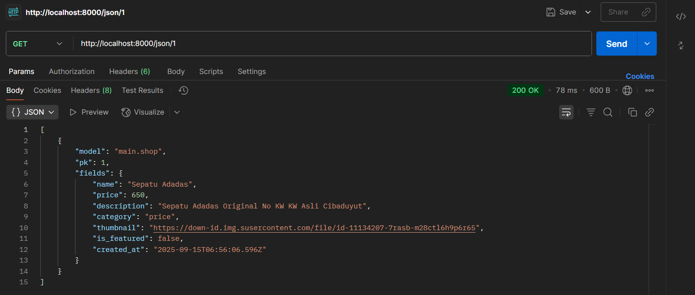
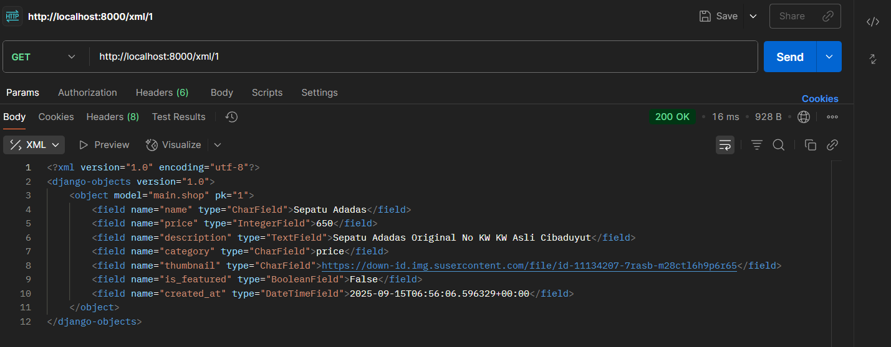

<b>Tugas 2</b>

1.
Pertama tama saya buat link repository yang bernama football-shop, setelah itu saya cloning dengan menjalankan perintah git clone (link repository). setelah terbuat suatu folder yang bernama football-shop, buka folder tersebut dan menjalankan perintah python -m venv env. setelah muncul folder env di vscode saya, saya aktifkan virtual environment itu dengan menjalankan perintah env\Scripts\activate. Fungsinya adalah untuk mengisolasi package serta dependencies dari aplikasi agar tidak bertabrakan dengan versi lain yang ada pada komputermu. Lalu saya membuat file dengan nama requirements.txt dan tambahkan beberapa dependencies yang isinya django, gunicorn, whitenoise, psycopg2-binary, requests, urllib3, python-dotenv lalu menginstall dengan perintah pip install -r requirements.txt. lalu saya bikin folder baru dengan perintah django-admin startproject football_shop . 

Setelah itu buat file .env di vs code lalu buka dan tambahkan konfigurasi PRODUCTION=False dan buat file .env.prod dengan isi seperti DB_NAME DB_HOST dan diisi dengan data yang sudah diberikan melalui email UI setelah itu modifikasi settings.py lalu modifikasi pada bagian ALLOWED_HOST dengan menambahkan string ["localhost", "127.0.0.1"] untuk keperluan development. Setelah itu tambahkan konfigurasi PRODUCTION tepat di atas code DEBUG di settings.py, dengan PRODUCTION = os.getenv('PRODUCTION', 'False').lower() == 'true', lalu ubah pada bagian DATABASES. Jalankan perintah python manage.py runserver, lalu buka http://localhost:8000 pada peramban web untuk melihat animasi roket sebagai tanda aplikasi Django kamu berhasil dibuat. 

Setelah persiapan awal selesai, langkah berikutnya adalah membuat aplikasi baru bernama main dengan perintah python manage.py startapp main. Perintah ini akan menghasilkan sebuah direktori bernama main yang berisi struktur dasar aplikasi Django. Selanjutnya, aplikasi tersebut harus didaftarkan ke dalam proyek dengan cara menambahkan 'main' ke dalam daftar INSTALLED_APPS yang ada di file settings.py proyek. Dengan begitu, Django mengenali aplikasi main sebagai bagian dari proyek football-shop.

Langkah berikutnya adalah menambahkan template dasar untuk menampilkan data. Di dalam direktori main, buat folder baru bernama templates, lalu buat file main.html. Isi file tersebut dengan struktur HTML sederhana, misalnya menampilkan informasi NPM, nama, dan kelas. Pada tahap ini, file HTML belum dihubungkan dengan Django, sehingga kamu bisa langsung membukanya di browser hanya untuk memeriksa tampilan dasarnya.

Setelah itu, masuk ke tahap menghubungkan view dengan template. Pada file views.py di aplikasi main, impor fungsi render dari django.shortcuts lalu buat fungsi show_main yang menerima parameter request. Di dalam fungsi ini, buat dictionary bernama context yang berisi data, misalnya NPM, nama, dan kelas, kemudian kembalikan fungsi render(request, "main.html", context) agar data tersebut dapat ditampilkan di main.html. Supaya template bisa menampilkan data secara dinamis, ubah isi main.html dengan menggunakan variabel template Django, yaitu {{ applicationname }}, {{ name }}, dan {{ class }}.

Langkah berikutnya adalah mengatur routing URL. Pertama, buat file urls.py di dalam direktori aplikasi main. Isi file tersebut dengan konfigurasi routing menggunakan urlpatterns, dan arahkan route '' (root) ke fungsi show_main. Setelah itu, buka file urls.py di level proyek (football-shop), impor fungsi include, lalu tambahkan route path('', include('main.urls')) agar proyek utama bisa mengarahkan request ke routing aplikasi main.

Setelah semua langkah ini selesai, jalankan server dengan perintah python manage.py runserver. Buka http://localhost:8000/ di browser, dan kamu akan melihat halaman HTML yang sudah berisi data NPM, nama, dan kelas yang ditarik dari context view. Pada tahap ini, aplikasi Django sudah berhasil menampilkan halaman HTML dasar melalui alur MVT.

Setelah berhasil menampilkan data sederhana melalui view dan template, tahap berikutnya adalah membuat model untuk merepresentasikan data di basis data. Pada file models.py di aplikasi main, saya melakukan modifikasi dengan menambahkan sebuah kelas bernama Product. Model ini menggunakan modul models dari Django serta modul uuid untuk kebutuhan unik jika ingin dikembangkan lebih lanjut. Di dalam kelas Product, saya mendefinisikan beberapa field, yaitu name (CharField) untuk nama produk, price (IntegerField) untuk harga, description (TextField) untuk deskripsi, category (CharField dengan pilihan kategori seperti price, shoes, jersey, ball, headband, cone, dan vest), thumbnail (URLField opsional untuk menyimpan tautan gambar produk), serta is_featured (BooleanField) untuk menandai apakah produk tersebut termasuk unggulan atau tidak.

Selain itu, saya juga menambahkan method dan properti tambahan agar model lebih kaya fitur. Method __str__ digunakan untuk menampilkan representasi teks dari objek, properti is_premium digunakan untuk menentukan apakah suatu produk termasuk premium (khususnya kategori shoes atau ball dengan harga di atas 1.500.000), sedangkan method is_training_gear digunakan untuk mengecek apakah produk termasuk perlengkapan latihan seperti cone, vest, atau headband.

Dengan struktur model ini, data produk dapat disimpan dengan lebih rapi, serta memiliki logika bisnis sederhana langsung di dalam model. Setelah model selesai dibuat, langkah selanjutnya adalah menjalankan perintah python manage.py makemigrations dan python manage.py migrate untuk membuat dan menerapkan skema tabel Product ke dalam basis data.

Setelah aplikasi selesai dibuat secara lokal, langkah selanjutnya adalah melakukan deployment ke PWS agar aplikasi dapat diakses melalui Internet. Pertama, masuk ke halaman PWS dan login menggunakan akun SSO UI. Setelah berhasil login, buat project baru, kemudian beri nama project sesuai kebutuhan, misalnya footballshop. Selanjutnya, hubungkan project di PWS dengan repository GitHub yang sudah dibuat, lalu pilih branch yang akan digunakan, yaitu master.

2. 

3. 
Dalam proyek Django, file settings.py berperan sebagai pusat pengaturan utama yang mengendalikan bagaimana aplikasi dapat berjalan dengan baik. Di dalamnya terdapat berbagai pengaturan penting, mulai dari konfigurasi database yang menentukan jenis basis data yang digunakan, nama basis data, hingga informasi login seperti user dan password. Selain itu, file ini juga memuat daftar aplikasi yang dipakai dalam proyek melalui INSTALLED_APPS, middleware yang berfungsi memproses request dan response, serta pengaturan template dan static files untuk menangani file HTML dan aset lainnya. Aspek keamanan seperti SECRET_KEY dan ALLOWED_HOSTS juga dikendalikan melalui file ini.

4. 
Migrasi database di Django adalah proses untuk menyesuaikan struktur basis data dengan model yang sudah dibuat di aplikasi. Setiap kali kita menambahkan atau mengubah model di file models.py, Django tidak langsung mengubah database, tetapi terlebih dahulu membuat file migrasi menggunakan perintah python manage.py makemigrations. File migrasi ini berisi instruksi perubahan yang perlu dilakukan pada database. Setelah itu, perintah python manage.py migrate dijalankan untuk menerapkan instruksi tersebut sehingga database benar-benar diperbarui sesuai model terbaru.

5. 
Django sering dijadikan pilihan pertama untuk belajar pengembangan perangkat lunak karena framework ini punya struktur yang rapi dan banyak fitur bawaan. Django memakai konsep MTV (Model-Template-View) yang bisa membantu pemula memahami bagaimana data, logika program, dan tampilan saling terhubung dalam sebuah aplikasi web. Selain itu, Django sudah menyediakan banyak hal penting seperti sistem login, panel admin, pengaturan database, sampai manajemen URL, sehingga kita bisa langsung fokus ke logika aplikasi tanpa ribet menambahkan library lain.

6. 
Tidak ada feedback untuk asisten dosen, asisten dosen sudah membantu saya saat saya bertanya dan butuh bantuan.

<b>Tugas 3</b>

1.
Data delivery itu sangat penting untuk menjadi “jembatan” antara pengguna dan sistem. Bayangkan, kalau kita klik tombol atau isi form, tanpa adanya mekanisme pengiriman data, permintaan itu nggak akan pernah sampai kepada server. Begitu juga sebaliknya, hasil pemrosesan dari server nggak akan bisa balik lagi ke pengguna. Jadi data delivery ini yang bikin interaksi dua arah berjalan lancar mulai dari input, proses, sampai output. Selain itu, data delivery juga menjaga biar informasi yang lewat antar bagian platform tetap konsisten dan nggak hilang di tengah jalan. Dengan adanya alur pengiriman data yang rapi, platform jadi bisa berkembang lebih jauh, mudah untuk diintegrasikan dengan layanan lain, dan tentunya membuat pengalaman pengguna jadi lebih baik.

2.
Kalau dibandingkan, JSON biasanya lebih nyaman dipakai daripada XML, apalagi dalam membuat aplikasi web atau API di zaman sekarang. JSON itu lebih simpel karena strukturnya cuma pakai pasangan key–value dan array, jadi gampang dibaca manusia maupun mesin. Bandingkan sama XML yang pakai banyak tag buka–tutup, jadinya data lebih panjang dan berat. Selain itu, JSON langsung nyambung sama JavaScript, jadi nggak perlu parsing ribet lagi. Makanya JSON jauh lebih populer, karena lebih ringan, cepat, dan praktis. Walaupun XML masih kepake di beberapa situasi tertentu yang butuh format baku atau banyak metadata, kebanyakan platform modern lebih milih JSON karena memang lebih efisien dan ramah dipakai sehari-hari.

3.
Di Django khususnya di form.is_valid, method is_valid() digunakan untuk mengecek apakah data yang dimasukin ke form itu sudah sesuai aturan atau belum. Misalnya, kalau ada field nama yang wajib diisi, atau ada batasan jumlah karakter, semua itu bakal dicek di sini. Kalau datanya sudah benar semua, is_valid() mengembalikan nilai True, tapi kalau ada yang salah akan mengembalikkan False dan Django otomatis nyimpen pesan error yang bisa langsung ditampilkan ke pengguna. Kita butuh langkah ini supaya data yang nyampe ke database bener-bener rapi, valid, dan tidak ada yang aneh, seperti angka yang diisi huruf atau kolom wajib malah kosong. Jadi intinya, is_valid() ini seperti filter pertama yang menjaga kualitas data sebelum disimpan.

4.
Kita sangat membutuhkan csrf_token di Django karena dia berguna untuk menjadi pelindung utama dari serangan CSRF atau Cross-Site Request Forgery. Token ini bekerja dengan cara memberi kode unik di setiap form, jadi pas data dikirim ke server, Django bisa ngecek apakah permintaan itu bener-bener datang dari user kita sendiri atau bukan. Kalau kita bikin form tanpa csrf_token, Django biasanya langsung menolak request POST dan kasih error 403. Nah, masalahnya kalau proteksi ini dimatiin, penyerang bisa memanfaatkan celah itu. Misalnya, mereka bikin website jahat yang secara diam-diam mengirim request ke aplikasi Django kita, padahal user lagi login di situ. Karena browser otomatis ngikutin cookie sesi user, server bakal menganggap request palsu itu sah. Akibatnya, user bisa dipaksa melakukan hal-hal berbahaya seperti transfer uang, ganti password, atau hapus data tanpa sadar. Jadi intinya, csrf_token ini penting banget biar server cuma menerima form asli dari aplikasi kita, bukan jebakan dari luar.

5.
Langkah pertama saya membuat kerangka atau skeleton aplikasi. Pada tahap ini, saya menambahkan folder templates di dalam project, kemudian membuat file base.html sebagai template dasar. Supaya Django bisa mengenali template tersebut, pengaturan di settings.py perlu diubah beberapa. Setelah itu, file main.html diperbarui agar menggunakan base.html dengan menampilkan informasi berupa nama website, NPM, nama, kelas, serta daftar shop.

Langkah berikutnya, kita membuat form untuk input data shop. Caranya dengan menambahkan file forms.py di folder main dan mendefinisikan form berdasarkan model Shop, lengkap dengan field yang diperlukan seperti title, content, category, dan lain-lain. Setelah form tersedia, bagian views juga perlu diperbarui. Beberapa fungsi ditambahkan, antara lain show_main untuk menampilkan halaman utama, create_shop untuk membuat shop baru, dan show_shop untuk menampilkan detail shop berdasarkan id.

Agar fungsi-fungsi tadi bisa diakses, kita menambahkan routing di urls.py. Di sini, setiap request diarahkan ke views yang sesuai, misalnya halaman utama, tambah shop, maupun detail shop. Template main.html juga diperbarui dengan menambahkan tombol untuk membuat shop baru dan menampilkan daftar shop dalam bentuk list. Daftar ini dilengkapi dengan kategori, tanggal dibuat, jumlah views, thumbnail, serta potongan isi konten.

Selain itu, dua template tambahan juga dibuat, yaitu create_shop.html untuk form input data dan shop_detail.html untuk menampilkan detail shop yang dipilih. Tidak hanya itu, aplikasi juga diperluas dengan menambahkan endpoint XML dan JSON. Beberapa fungsi views baru dibuat untuk mengembalikan data dalam format XML dan JSON, termasuk versi by ID untuk mengambil data shop tertentu. Routing di urls.py kembali diperbarui agar endpoint ini bisa diakses.

Sebagai langkah akhir, semua fungsi yang sudah dibuat diuji menggunakan Postman. Server Django dijalankan, kemudian endpoint XML dan JSON diakses untuk memastikan data bisa ditampilkan dengan benar, baik untuk semua data maupun berdasarkan ID.

6.

<b>Tugas 4</b>

1.
AuthenticationForm di django adalah form bawaan yang dipakai untuk memproses login. Form ini otomatis memvalidasi username dan password yang dimasukkan user dengan data di database. Kalau cocok, user bisa login, kalau tidak, akan langsung di eksekusi dan muncul pesan error.

Kelebihan AuthenticationForm adalah praktis karena sudah tersedia dari django, jadi kita nggak perlu bikin form login dari nol. Sistem keamanannya juga sudah terjamin, misalnya password dicek dalam bentuk hash, bukan teks asli. Selain itu, form ini terintegrasi langsung dengan sistem autentikasi django, sehingga lebih mudah digunakan, dan sudah ada validasi otomatis untuk menampilkan error jika data login salah.

Namun, ada juga kekurangannya. Form ini kurang fleksibel kalau ingin login menggunakan field lain seperti email atau nomor HP, karena default-nya hanya mendukung username dan password. Dari sisi tampilan, AuthenticationForm masih sederhana sehingga biasanya butuh di-custom agar sesuai dengan desain aplikasi. Selain itu, form ini lebih cocok digunakan bersama user model bawaan django kalau model user sudah terlalu banyak diubah, biasanya butuh override atau bahkan bikin form kustom baru.

2. 
Autentikasi adalah proses untuk memverifikasi identitas seorang user. Tujuannya memastikan bahwa orang yang mencoba masuk benar-benar sesuai dengan data yang terdaftar, misalnya melalui username dan password. Dengan autentikasi, sistem dapat mengenali siapa yang sedang mengakses aplikasi.

Otorisasi adalah proses untuk menentukan apa saja yang boleh dilakukan oleh pengguna setelah berhasil diautentikasi. Tujuannya adalah memberikan pembatasan akses sesuai dengan peran atau izin yang dimiliki pengguna. Dengan otorisasi, sistem dapat mengontrol hak apa saja yang dimiliki setiap pengguna di dalam aplikasi.

Autentikasi
1. User buka halaman login
2. User isi username & password
3. Server cek database User :
   - Kalau data cocok : user dianggap valid
   - Kalau tidak cocok : akses ditolak
4. Server buat session

Otorisasi
1. User sudah login (authenticated)
2. User minta akses halaman tertentu
3. Server cek role/permission user
   - Kalau user punya izin : akses diberikan
   - Kalau tidak punya izin : akses ditolak (403 Forbidden)
4. Halaman/aksi ditampilkan sesuai hak akses user

3.
Cookies adalah data kecil yang disimpan pada browser user untuk menyimpan informasi tertentu, misalnya preferensi tampilan, login otomatis, atau keranjang belanja sederhana. Kelebihan cookies yaitu tidak membebani server karena penyimpanan dilakukan di sisi client, mudah diakses langsung oleh JavaScript, dan bisa bertahan dalam jangka waktu lama. Namun, cookies memiliki keterbatasan seperti ukuran yang kecil, rentan dicuri melalui serangan seperti CSRF/XSS jika tidak diamankan, serta tidak cocok untuk menyimpan data sensitif tanpa enkripsi.

Session adalah mekanisme penyimpanan data yang dilakukan di sisi server, dengan browser hanya menyimpan session ID dalam bentuk cookie. Kelebihan session yaitu lebih aman karena data tidak langsung berada di sisi user, bisa menampung informasi lebih besar, dan sulit dimanipulasi oleh pengguna. Kekurangannya adalah menambah beban server karena harus menyimpan data untuk banyak user, masih bergantung pada cookie untuk menyimpan session ID, serta data bisa hilang saat session berakhir akibat timeout atau logout.

4.
Cookie sebenarnya tidak bisa dibilang aman begitu saja, karena ada beberapa risiko yang perlu diwaspadai. Misalnya, cookie bisa dicuri lewat serangan CSRF, dapat disadap kalau dikirim tanpa HTTPS, atau bahkan dimodifikasi karena memang disimpan di sisi user. Jadi, kalau dipakai untuk menyimpan data penting tanpa perlindungan tambahan, jelas berbahaya.
Django menangani hal tersebut dengan cara :
   - Django otomatis melindungi cookie penting seperti sessionid.
   - Developer bisa menambahkan flag Secure agar cookie hanya dikirim lewat HTTPS.
   - Untuk data sensitif, Django lebih menyarankan menyimpannya di session server, bukan di browser.

5. 
Pada tutorial ini saya mengimplementasikan fitur registrasi, login, dan logout. Registrasi dibuat menggunakan UserCreationForm agar pengguna baru dapat membuat akun. Fitur login diatur dengan AuthenticationForm dan fungsi authenticate serta login untuk memverifikasi identitas pengguna. Logout menggunakan fungsi logout yang menghapus sesi pengguna sekaligus cookie last_login. Selain itu, halaman utama dan detail produk saya batasi hanya dapat diakses oleh pengguna yang sudah berhasil login.

Untuk pengujian aplikasi, saya membuat dua akun dummy. Masing-masing akun kemudian saya isi dengan tiga data dummy create produk. Data dummy ini membantu dalam menguji apakah setiap akun benar-benar hanya dapat melihat dan mengelola produk yang dimilikinya.

Saya menghubungkan model Shop dengan model User menggunakan ForeignKey(User, on_delete=models.CASCADE). Dengan cara ini, setiap produk yang ditambahkan akan otomatis terhubung dengan user yang sedang login. Apabila user dihapus dari sistem, maka seluruh produk yang dimiliki user tersebut juga akan terhapus. Mekanisme ini memastikan data tetap konsisten dan hanya pemilik sah yang dapat mengakses artikel produknya.

Pada halaman utama (main.html), saya menampilkan informasi mengenai pengguna yang sedang login, seperti username. Selain itu, saya menambahkan cookie bernama last_login yang berfungsi untuk menyimpan waktu terakhir kali pengguna berhasil login. Cookie ini akan dibuat secara otomatis ketika login berhasil, dan dihapus saat pengguna melakukan logout. Dengan begitu, pengguna bisa mengetahui kapan terakhir kali mereka mengakses aplikasi.

<b>Tugas 5</b>

1.
1. Inline style
Style yang ditulis langsung di elemen HTML menggunakan atribut style. Prioritasnya paling tinggi dan menimpa semua aturan CSS lainnya, kecuali ada !important.
2. ID selector (#id)
Selector berdasarkan ID elemen, misal #header. Spesifisitasnya tinggi dan lebih diutamakan dibanding class atau element selector.
3. Class, attribute, dan pseudo class selector
Digunakan untuk menarget elemen berdasarkan class, atribut, atau keadaan tertentu. Spesifisitasnya menengah, lebih rendah dari ID tapi lebih tinggi dari element selector.
4. Element selector dan pseudo element
Menarget tag HTML secara langsung. Spesifisitasnya paling rendah dibanding ID atau class selector.
5. Universal selector (*)
Menarget semua elemen. Prioritas paling rendah, hanya berlaku jika tidak ada aturan lain yang lebih spesifik.
6. Urutan penulisan
Jika dua aturan memiliki spesifisitas sama, aturan yang ditulis terakhir di CSS akan diterapkan.
7. !important
Dapat menimpa semua aturan normal, meskipun jika ada beberapa !important, spesifisitas masih menentukan pemenangnya.

2.
Responsive design menjadi konsep penting dalam pengembangan aplikasi web karena memungkinkan tampilan dan fungsi website menyesuaikan diri secara otomatis dengan berbagai ukuran layar dan perangkat, seperti desktop, tablet, atau smartphone. Dengan responsive design, user mendapatkan pengalaman yang nyaman, navigasi mudah, dan konten tetap terbaca tanpa harus melakukan zoom atau scroll horizontal. Hal ini juga penting untuk SEO, karena mesin pencari lebih menyukai website yang mobile-friendly.

Contoh aplikasi yang sudah menerapkan responsive design adalah Instagram. Baik di desktop maupun di smartphone, layout menyesuaikan ukuran layar, tombol dan gambar tetap proporsional, serta navigasi tetap mudah diakses. Sebaliknya, contoh aplikasi yang belum menerapkan responsive design misalnya beberapa website sekolah, yang tampilan desktop-nya dipaksa ditampilkan di smartphone tanpa penyesuaian. Hal ini membuat teks terlalu kecil, tombol sulit ditekan, dan user harus melakukan zoom atau scroll horizontal, sehingga pengalaman user menjadi buruk.

3.
1. Margin
Margin adalah ruang di luar elemen yang memisahkan elemen tersebut dari elemen lain di sekitarnya. Margin tidak memiliki warna atau garis, sehingga hanya berfungsi memberikan jarak antar elemen. Dengan mengatur margin, kita bisa mengontrol seberapa jauh elemen dari elemen lain tanpa memengaruhi ukuran kontennya.

Contoh: Misalkan kita memiliki sebuah div yang ingin diberi jarak dari elemen lain di sekitarnya. Kita bisa menulis CSS seperti div { margin: 20px; }, sehingga elemen tersebut memiliki jarak 20px dari semua sisi terhadap elemen lain.

2. Border
Border adalah garis di sekitar elemen yang berada di antara padding dan margin. Border bisa diberi warna, ketebalan, dan gaya. Border membuat elemen lebih terlihat jelas dan memberikan batas visual antara elemen dengan sekitarnya.

Contoh: Jika kita ingin menambahkan garis biru di sekitar sebuah div, kita bisa menulis CSS seperti div { border: 2px solid blue; }. Maka elemen tersebut akan memiliki garis tepi biru setebal 2px yang membatasi konten di dalamnya.

3. Padding
Padding adalah ruang di dalam elemen, yaitu jarak antara konten elemen dengan border elemen. Padding membuat konten tidak menempel langsung ke border sehingga tampilan lebih rapi dan nyaman dibaca.

Contoh: Jika sebuah div memiliki teks di dalamnya dan ingin memberi ruang antara teks dengan garis border, kita bisa menulis CSS seperti div { padding: 15px; }. Dengan begitu, teks akan berada 15px di dalam dari garis border, membuat tampilan lebih enak dilihat.

4.
Flexbox adalah metode layout CSS yang dirancang untuk mengatur elemen secara fleksibel dalam satu dimensi, baik baris maupun kolom. Dengan flexbox, kita bisa mengatur ukuran, posisi, dan jarak antar elemen secara otomatis sesuai ukuran container. Flexbox sangat berguna untuk membuat layout yang responsif, seperti menata tombol, kartu produk, atau menu navigasi, karena elemen bisa menyesuaikan diri saat ukuran layar berubah.

Grid layout adalah metode layout CSS yang lebih canggih yang bekerja dalam dua dimensi, yaitu baris dan kolom sekaligus. Dengan grid, kita bisa membuat struktur kompleks seperti dashboard, galeri foto, atau halaman majalah online, karena kita bisa menentukan posisi elemen persis di grid tertentu. Grid layout sangat berguna untuk mendesain tata letak halaman yang lebih terstruktur dan rapi, terutama ketika elemen-elemen harus sejajar secara presisi di baris dan kolom.

5.
Jadi pertama, saya mulai dengan menyiapkan fungsi untuk menghapus dan mengedit product. Untuk menghapus, saya buat fungsi delete_shop yang menerima id product, lalu mencari product di database dan menghapusnya. Setelah itu, saya arahkan user kembali ke halaman daftar product. Untuk edit, saya buat fungsi edit_shop yang menampilkan form berisi data product yang sudah ada. Ketika form di-submit, data product di-update di database, lalu saya kembalikan user ke halaman daftar. Tentunya saya juga menambahkan url path untuk kedua fungsi ini di urls.py.

Selanjutnya, saya memodifikasi halaman login, register, tambah product, edit product, dan detail product supaya lebih menarik. Untuk login dan register, saya letakkan form di tengah layar dengan background, dan tombol serta input yang terlihat modern. Untuk tambah dan edit product, saya buat card mirip login, lengkap dengan tombol submit dan validasi pesan sukses/gagal. Halaman detail product menampilkan gambar, nama, deskripsi, harga, serta tombol edit dan hapus.

Kemudian untuk halaman daftar product, saya buat pengecekan apakah ada product tersimpan atau tidak. Kalau belum ada, saya tampilkan gambar dan pesan yang memberitahu bahwa belum ada product terdaftar. Kalau sudah ada, saya tampilkan setiap product dalam card yang responsif menggunakan grid satu kolom untuk mobile, dua kolom untuk tablet, tiga kolom untuk desktop. Setiap card menampilkan gambar product, nama, deskripsi, harga, plus tombol Edit dan Hapus. Semua desain saya buat berbeda dari tutorial supaya unik.

Selanjutnya, saya buat navbar yang responsif untuk navigasi aplikasi. Navbar ini menampilkan link ke halaman daftar product, tambah product, dan logout. Saya pakai utilitas Tailwind supaya navbar bisa menyesuaikan tampilan di desktop maupun mobile. Untuk tampilan mobile, saya tambahkan tombol hamburger0 yang ketika diklik akan menampilkan link secara vertikal.

Terakhir saya menjawab pertanyaan readme, dan melakukan add-commit-push ke github maupun PWS.

